Flipance is a free Discord bot to create cross-marketplace NFT alerts.

As a server-owner, you can announce a collection's activity (sales, offers, etc.) on a discord server.

As an NFT collector or trader, you can receive DMs whenever your NFTs sell, your offers are accepted, or you receive a valuable offer.

# Sponsors


We want to thank [LooksRare](https://looksrare.org/) for funding this project.

# Commands

Discord users interact with Flipance using slash commands on the Discord server where the bot resides. These are the current available commands:

## /help

Provides information about the bot and its commands.

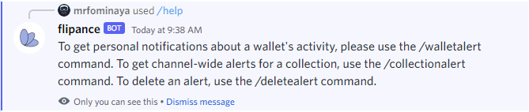

## /walletalert

Creates a personal alert to track a wallet's NFT activity across marketplaces. Parameters:

- **address** (required): The Ethereum address of the wallet you want to track.
- **nickname** (optional): Wallet's nickname (must have between 1-50 characters, no spaces)

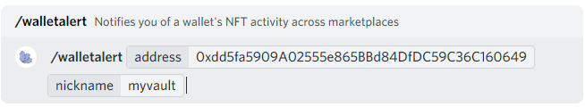

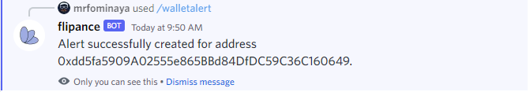

## /collectionalert

Creates a personal alert to track a collections's NFT activity across marketplaces. Parameters:

- **address** (required): The Ethereum address of the collection you want to track.
- **nickname** (optional): Collection's nickname (must have between 1-50 characters, no spaces)

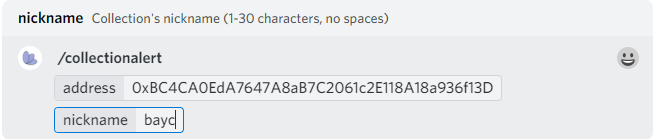

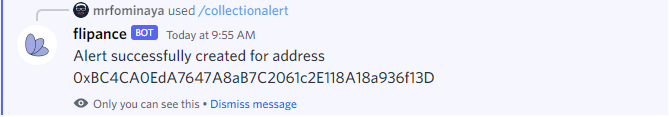

## /serveralert

Creates a server-wide alert to track a collections's NFT activity across marketplaces. Parameters:

- **address** (required): The Ethereum address of the collection you want to track.
- **nickname** (optional): Collection's nickname (must have between 1-50 characters, no spaces)

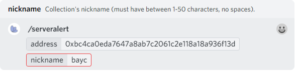

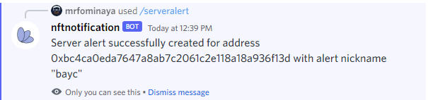

## /listalerts

List your active wallet alerts on the current server and the server's collection alerts.

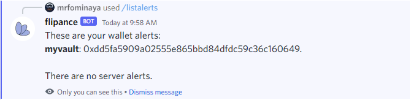

## /deletealert

Deletes the server's alert for the specified collection address or nickname. Parameters:

- **alert** (required): Alert's nickname or address.

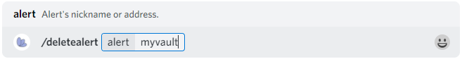

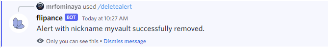

## /settings

Display your current settings. Parameters:

- **alert** (optional): Alert's nickname or address.

If you don't specify any parameters, you will see the account settings:

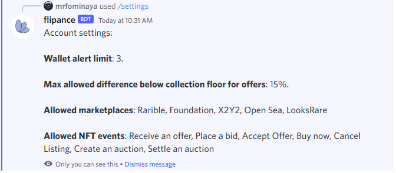

If you specify an alert, you will see the settings for that alert:

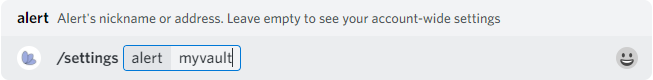

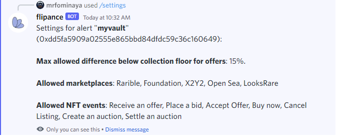

## /setallowedmarketplaces

Choose the marketplaces you wish to receive alerts from. Parameters:

- **alert** (optional): Alert's nickname or address.

If you don't specify any parameters, you will change your account settings. If you specify an alert, you will change the settings for that alert. Example setting your account's allowed marketplaces:

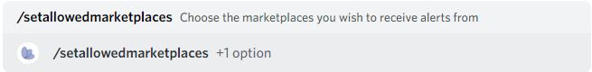

When you run the command, you will see a select menu.

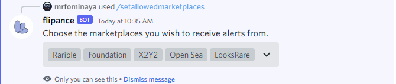

Click on each marketplace to toggle it on/off.

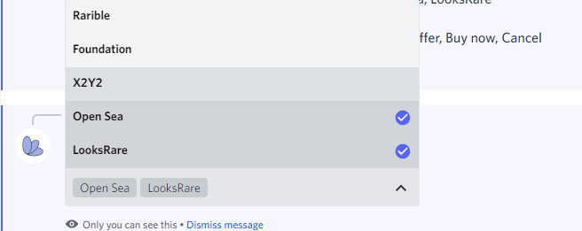


## /setallowedevents

Choose the events you wish to receive alerts for. Parameters:

- **alert** (optional): Alert's nickname or address.

If you don't specify any parameters, you will change your account settings. If you specify an alert, you will change the settings for that alert. Example setting your account's allowed events:

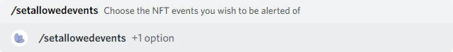

When you run the command, you will see a select menu.


Click on each event to toggle it on/off.

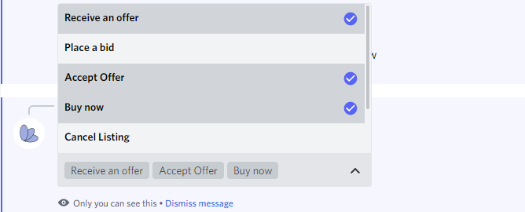

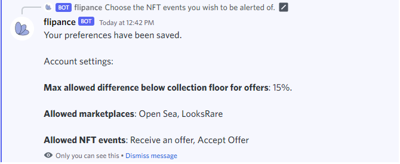

## /setmaxofferfloordifference

Set a threshold for offer notifications so that you are only notified of offers when they are up to X% below the collection's current floor. Parameters:

- **percentage** (required): Difference from the floor as a percentage i.e. '20'.
- **alert** (optional): Alert's nickname or address.

If you don't specify any parameters, you will change your account settings. If you specify an alert, you will change the settings for that alert. Example setting your account's allowed events:

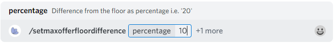

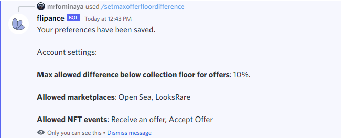

## /setnickname

Set an alert's nickname. Parameters:

- **address** (required): The alert's address.
- **alert** (required): The new nickname for the alert.

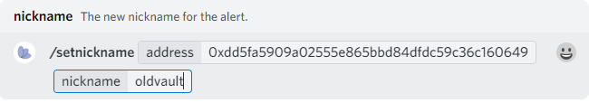

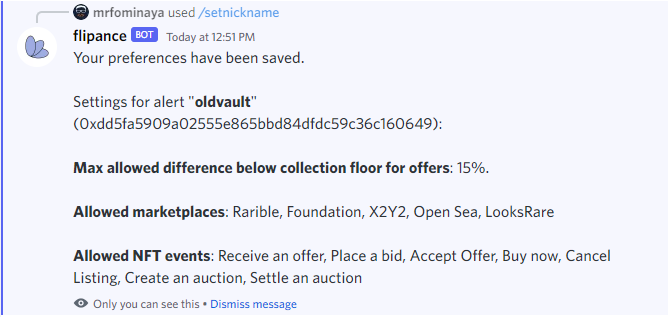

# Trying out the bot

If you just want to check out how the bot works, you can [join the flipance's official server](https://discord.gg/TKHCYM88XX) and interact with the bot there to set up your alerts.

You can also [invite the bot to your own server](https://discord.com/oauth2/authorize?client_id=955754533454229506&scope=bot%20applications.commands&permissions=2147534848) and create your alerts there.

In either case, you'll need to keep your DMs open in at least one server where the bot is invited so it can reach you.

# Hosting the bot

If you want to self-host the bot, we provide the necessary tools. You have two options:

1. Use our prepared terraform config that deploys to AWS.
2. Self-host on your own server with your custom installation.

Since the bot is open-source, you can fork this repository and modify it with your own branding and custom messages. Hosting the bot yourself also means you will have full control of the data.

Next we'll go over what you need to get your own bot up and running.

## Service providers

To host your own bot you will need to sign up to some API service providers. All the APIs listed here offer at least a free tier that will be enough to run the bot:

- [Discord](https://discord.com/register): Necessary to create a Discord bot.
- Ethereum RPC connection services. You can use Alchemy's API key for all ethereum requests. However, consider adding some of the other RPC providers to raise the bot's rate limits and for fault tolerance.
  1. [Etherscan](https://etherscan.io/register)
  2. [Infura](https://infura.io/register)
  3. [Pocket](https://mainnet.portal.pokt.network/#/signup)
  4. [Alchemy](https://www.alchemy.com/)
- NFT APIs: Both are optional. You can provide only the Alchemy API key. We currently support two. If you use both, the bot will be able to pull more information.
  1. [Moralis](https://admin.moralis.io/register).
  2. [NFTScan](https://developer.nftscan.com/user/regist)

### Creating the Discord bot

You will also need to configure a Discord bot from [Discord's Developer Portal](https://discord.com/developers/applications). To do so, click on "New Application" (top right) and give the bot a name. You will also need to click on "Bot" on the Settings menu (left) and click on "Add Bot" (right). This will create a bot token that you need to save for later (environment variable DISCORD_BOT_TOKEN).

## Bot Configuration

Whether you self-host the bot or you use the prepared deployment, you will need certain API keys and service tokens. These are the minimum necessary environment variables:

- **ALCHEMY_API_KEY**: "YOUR_ALCHEMY_API_KEY"
- **DISCORD_CLIENT_ID**: "YOUR_DISCORD_CLIENT_ID"
- **DISCORD_BOT_TOKEN**: YOUR_DISCORD_BOT_TOKEN
- **DB_HOSTNAME**: localhost (manual deployment), flipance (kubernetes deployment) or an IP address where a postgresql server is hosted.
- **POSTGRES_PASSWORD**: 1234
- **POSTGRES_USERNAME**: postgres

There are also some global settings you can modify as environment variables:

- **MAX_NICKNAME_LENGTH**: Max. length in characters that alert nicknames can have.
- **MAX_OFFER_FLOOR_DIFFERENCE**: Default max. difference as a percentage between the floor and the offer for all alerts.
- **DEFAULT_USER_ALERT_LIMIT**: Default max number of personal alerts (any combination of wallet and collection alerts) that a user can have.
- **DEFAULT_SERVER_ALERT_LIMIT**: Default max number of server alerts a server can have.
- **MARKETPLACES**: Comma-separated list of marketplaces you want the bot to poll for events. Default (all marketplaces): looksRare,openSea,x2y2,foundation,rarible.
- **ETHEREUM_NETWORK**: The ethereum network the bot will connect to. Currently supported values are _homestead_ (the default, also known as "mainnet") and _rinkeby_. Only LooksRare trades are tracked on the Rinkeby testnet.
- **LOGGING_LEVELS**: Comma-separated list of logging levels you are interested in. Each log line is a JSON object with a _level_, a _message_ and additional properties. Current log levels: info,error,warning. Default: info,error.
- **BACKUP_LOGS**: (Boolean) Whether or not the logs should be backed up to log files.

## Terraform deployment

**WARNING: If you deploy this terraform configuration, you will create an EC2 instance with a monthly expense billed to your account**

The file _variables.tf_ contains the definition and description of the variables necessary to set up the AWS infrastructure. The file example.tfvars contains an example of how to assign values to these variables. Since this is sensitive information, you should create a _secret.tfvars_ file that is NOT committed to Git history and set the variables there.

To get started you will need a S3 bucket to store the terraform state on the region you are deploying to (defaults to us-east-1). Make sure the bucket is set to _Block all public access_. You can use a bucket you already own or create a new one following the "Create bucket" wizard and name it something like "flipance-tfstate-{your project's name}". Next, edit the file backend.conf with the following information:

- **bucket**: Name of the S3 Bucket used to store terraform's state. Can be any bucket as long as the TFSTATE_BUCKET_KEY below is not used/overwritten by others
- **region**: [AWS region](https://docs.aws.amazon.com/AWSEC2/latest/UserGuide/using-regions-availability-zones.html) you wish to deploy to.

Run the following command:

```
npm run setup-deployment
```

Note: If you run the script using a bucket name that you do not own/does not exists, the script will fail and you will have to manually remove the .terraform folder, fix the bucket name and run the script again.

If you fork this repository as a private repo, you will need a Github access token to pull. To generate one, go to [Github's Personal access tokens page](https://github.com/settings/tokens), log in with your profile, and click on "Generate new token". When you create your own secret.tfvars file with your API keys, you will need to specify the terraform variable _GITHUB_TOKEN_ with your Github token.

Once Terraform has finished initializing, you can run the command:

```
npm run deploy
```

If you did not fill out the _secret.tfvars_ file with the necessary information, you will be asked to fill in the missing variables in the console. Once you have provided all the necessary variables, you will have to confirm the terraform creation by typing "yes".

After a while, the server should finish setting up and the bot will come online. If that does not happen for whatever reason, you can connect to the instance manually through SSH. There will be a log with the installation output at "/home/ubuntu/startup.log". The key to connect to the instance is located at "C:\Users\{YOUR USER}\.ssh" if you are on Windows when running this script.

On the [EC2 Instance dashboard](https://us-east-1.console.aws.amazon.com/ec2/v2/home?region=us-east-1#Instances:) you can find your instance running. Click on it > Click on Connect (top right) > SSH Client > Copy the option at the bottom and run it from the Command Prompt. It will look something like:

```
ssh -i "YOUR_PATH_TO_SSH/flipance.pem" ubuntu@ec2-{EC2-ELASTIC-IP}.compute-1.amazonaws.com
```

## Self-hosting on your own infrastructure

To start the bot and begin handling requests, you will need to install the following software:

- [Node.js](https://nodejs.org/en/): We recommend version 16 or later.
- [PostgreSql](https://www.postgresql.org/).

Once you set up PostgreSql, you will need to either create a user specifically for the bot or use the default admin. In either case, you must set the POSTGRES_USERNAME and POSTGRES_PASSWORD env variables to a valid PostgreSql user.

The bot script relies on environment variables. You can either set these at the system-level, or create a _.env_ file at the project's root where you set the secrets using the same format as in the .tfvars files. You can see an example of what variables and what values to set in the file _example.env_.

Once you set up the tools and the environment variables, you will need to create and configure the DB by running the command. Sometimes the main Flipance repo will be updated with new functionality and you will need to re-run this script so the database's schema can support the new features:

```
npm run setup-db
```

To run the bot manually you will need to run two processes: the crawler and at least one bot shard. If you are using forever to keep the scripts up, you would need to run the following commands from the project's root:

```
forever start scripts/crawler.js
forever start scripts/bot-shard.js
```

If the bot becomes very popular and it is installed in over 2,000 Discord servers, you might need to start sharding. You can also use sharding to distribute the load of handling user requests among different processes/instances. This project supports sharding through env variables:

- **SHARD_ID**: The shard id for the specific instance or process. If you are running multiple shards on one machine, you can set the environment variable individually for each process like this: export SHARD_ID=1 || set SHARD_ID=1&& forever start scripts/crawler.js.
- **TOTAL SHARDS**: The total number of shards the bot is running across all instances/processes.

### Kubernetes configuration

The bot is split into services and ready to run as a Kubernetes cluster. You can find the Kubernetes configuration at the services folder. There are 3 Kubernetes deployments described there:

- **crawler**: The script that listens to new on-chain events and saves them to the database.
- **postgres**: The PostgreSQL database image. You can use your own hosted database instead if you set the _DB_HOSTNAME_ env variable to your database's IP.
- **shard**: The Discord client shard that polls the database for new events and notifies the users and servers assigned to it when the event is relevant to the user/server.

You need to either set the secrets to the Kubernetes cluster manually or add a secret.yaml file at the services/ folder with the environment variables using the following structure:

```yaml
apiVersion: v1
kind: Secret
metadata:
  namespace: flipance
  name: flipance-secrets
type: Opaque
stringData:
  ALCHEMY_API_KEY: YOUR_ALCHEMY_API_KEY
  DISCORD_CLIENT_ID: YOUR_DISCORD_CLIENT_ID
```

To set up the Kubernetes cluster, run the following commands:

```
kubectl apply -f services
kubectl apply -f services/postgres
kubectl apply -f services/crawler
kubectl apply -f services/shard
```

# Permissions

Only members with the "ADMINISTRATOR" permission in a server can create/edit/delete a server alert.

The bot's permissions are simple and limited to what is necessary for the bot's operations:

- Send Messages: To announce a collection events.
- Embed Links: To create a rich description of the NFT that has been bought/sold.
- Attach Files: To improve the appearance of the rich embed.

The Discord permission string with these permissions is **51200**.


# Security

NFT Discord servers and bots have become popular targets for hackers. Therefore, it is crucial to take every step to stop them from compromising a Discord bot/server. These are some of the things you need to keep in mind about this bot's security:

## Be careful with your DMs

If you have your Direct Messages open in a public server, anyone can message you. Many scammers lurk NFT Discord servers and DM the users there trying to pass as server admins, official bots or support.

You can turn off DMs for a specific server by right-clicking it on your server list.

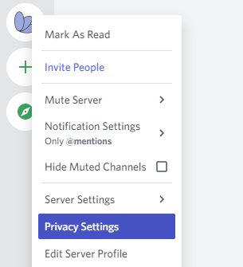

And then toggling off direct messages.

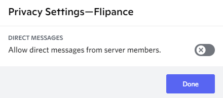

If you want to receive personal alerts from Flipance, you need to keep your DMs open in at least one server where Flipance is added. The most secure way to achieve this is to add it to your own personal server (or create one if you need it) and set your alerts there.

## Protecting against impersonators

Some scammers create impersonating bots with the same icon, name, description and even commands as legitimate bots that steal funds when users interact with them.

One simple protection against this attack as a user is to use Discord's "Add Note" function.

Right-click on the bot from the User List on the right.

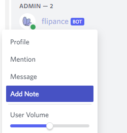

Click on Add Note. Whatever you write here is only visible to you and can't be altered by the bot.

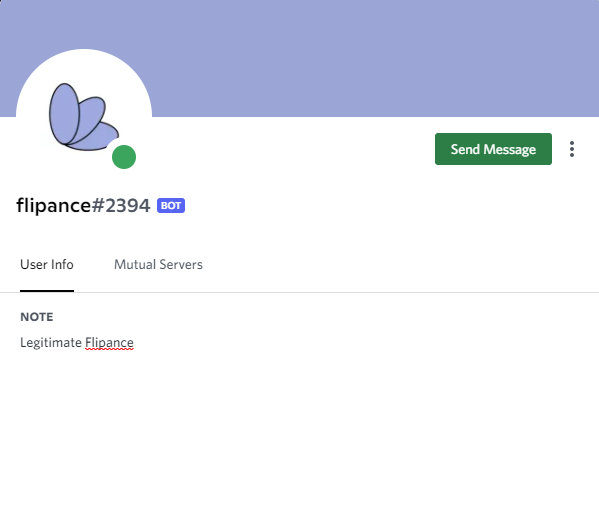

When you interact with the bot, check it has the correct Note.

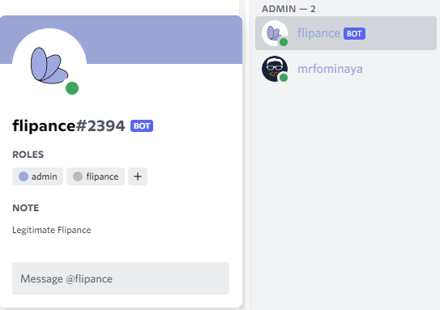

## Private keys

Protecting API keys and secrets is crucial. If you deploy the bot to your own infrastructure, you must remember that the bot needs to have access to these keys. You can restrict access by placing the secrets on a .env variable and changing the file's permissions.

If you use the terraform deployment, you will notice that it uses the [AWS System Manager Parameter Store](https://docs.aws.amazon.com/systems-manager/latest/userguide/systems-manager-parameter-store.html). The EC2 instance where the bot runs is assigned a role that can access these permissions. If you grant someone access to the EC2 instance, that person will be able to request the secret keys using the bot's credentials.

# Project structure

If you want to contribute, this section will help you understand how the code is structured by looking at what there is in each folder.

## src

The source folder is organized into modules that export multiple functions, grouped according to their general purpose:

- **src/blockchain**: Functions that pull data from the blockchain directly.
- **src/database**: Functions to set up and query the PostgreSQL database. Its tests are available in test/database
- **src/discord**: Functions that interface with the discord.js library.
- **src/looksrare-api**: Functions that call LooksRare's APIs.

The rest of the files in this folder are more or less generic purpose or at least used by different functions.

## test

Tests for each module, written using jest. The file structure should mirror the structure of the _src_ folder.

## services

The Kubernetes services needed to run the cluster, with the structure outlined in the [Kubernetes configuration](#kubernetes-configuration) section.

Each service has a Dockerfile that defines the service's image and a Kubernetes deployment file.

## scripts

The scripts are the entry point files that call the code from the _src_ folder. You can execute them on a bash terminal by running

```
npm run {SCRIPT_NAME}
```

where {SCRIPT_NAME} is the name of the script without the trailing ".js".

This is an overview of the scripts in this folder:

- **start**: This is the main script to run the Flipance bot. It coordinates all the
  different modules, polling offers, collection floors and user's tokens and also
  listens to blockchain events.
- **pull-env**: Used during EC2 instance initialization to retrieve and store environment variables on the instance.
- **register-commands**: Register the bot's commands on every Discord server where it is installed. You must run this script once if you modify any slash command.
- **setup-db**: Create and initialize the Flipance database. If the database exists, it will be updated with the latest changes to Flipance.

# Running the bot on a testnet

You can change the ethereum chain that the bot listens to by setting the **ETHEREUM_NETWORK** env variable. Currently the bot only supports Rinkeby events on LooksRare. To run the bot on the testnet without changing the environment, you can also start the crawler using the command:

```
npm run crawler-testnet
```

And the bot shard with its usual command:

```
npm run bot-shard
```

# Docker setup

There is a [Docker image available](https://hub.docker.com/repository/docker/fpluis/flipance-discord-bot) for this repository that lets you deploy your own Flipance instance using [docker-compose](https://docs.docker.com/compose/install/). You can pull the image by running the following command on this repository:

```
docker-compose pull
```

To run the instance, you need to have a .env file with your secrets at the project's root. Once you have pulled the image, run:

```
npm run compose-local
```

This will spin up three containers:

- postgres: The database.
- crawler: The node.js process that polls NFT events.
- shard: One node.js client that handles Discord user requests, polls the database for new events and sends notifications to users.
